# 4 · Flowcharts of Everything

Every important flow in UsSpace, drawn as a picture.
The diagrams use **Mermaid**, which GitHub and VS Code (with a Mermaid preview extension) draw automatically.

**Contents**

| Getting in | Every room | Safety & running |
| --- | --- | --- |
| [4.1 The big picture](#41-the-big-picture-user-journey) | [4.12 Chat: typing, sending and ticks](#412-chat-typing-sending-and-ticks) | [4.24 PIN lock and privacy blur](#424-pin-lock-and-privacy-blur) |
| [4.2 Create a room](#42-create-a-room) | [4.13 Camera: photo or video](#413-camera-photo-or-video) | [4.25 Close room = delete everything](#425-close-room--delete-everything) |
| [4.3 Join a room](#43-join-a-room) | [4.14 I'm missing you](#414-im-missing-you) | [4.26 Leave on this phone only](#426-leave-on-this-phone-only) |
| [4.4 Four keys from one code](#44-four-keys-from-one-secret-code) | [4.15 A call, step by step](#415-a-call-step-by-step) | [4.27 Notifications](#427-notifications) |
| [4.5 How one message travels](#45-how-one-message-travels) | [4.16 Direct, repaired or through the server](#416-direct-repaired-or-through-the-server) | [4.28 Quick search (Ctrl + K)](#428-quick-search-ctrl--k) |
| [4.6 Server checks on join](#46-what-the-server-checks-when-someone-joins) | [4.17 Call screen states](#417-call-screen-states) | [4.29 Phone navigation](#429-phone-navigation) |
| [4.7 Offline, restarts and catch-up](#47-offline-server-restarts-and-catch-up) | [4.18 Gallery: share, show, talk](#418-gallery-share-show-and-talk) | [4.30 Running it for real](#430-running-it-for-real-deployment) |
| [4.8 How the app starts](#48-how-the-app-starts) | [4.19 Canvas that grows](#419-canvas-a-board-that-grows) | |
| [4.9 Page map](#49-page-map-and-the-room-guard) | [4.20 Game invites](#420-game-invites) | |
| [4.10 Component tree](#410-screen-layout-component-tree) | [4.21 The 8 games](#421-the-8-games) | |
| [4.11 Newest wins + pop-ups](#411-shared-data-newest-wins-and-pop-ups) | [4.22 Music: one player, in sync](#422-music-one-player-in-sync) | |
| | [4.23 The server forgets](#423-the-server-forgets-what-both-phones-have) | |

---

## 4.1 The big picture (user journey)

```mermaid
flowchart TD
    Start(["👤 Visitor opens UsSpace"]) --> Landing["🌌 Landing page"]
    Landing -->|"Enter our space"| Gate{"Is this phone<br/>in a room?"}
    Gate -->|"Yes"| Lock{"PIN lock on?"}
    Lock -->|"Yes"| Pin["🔒 Enter PIN"] --> Home
    Lock -->|"No"| Home["🏠 Home"]
    Gate -->|"No"| Choose["🔐 Start page<br/>Create a room · Join a room"]
    Choose -->|"Create"| Create["Name + together since"] --> Code["🔑 Secret code<br/>Copy · Share · QR"]
    Code -->|"Partner joins"| Joined["💞 Partner joined!<br/>room locks to 2 phones"]
    Code -->|"Enter now"| Home
    Joined --> Home
    Choose -->|"Join"| Join["Code + name"] --> Home
    Home --> Rooms["💬 Chat + 📞 calls · 🖼️ Gallery · 🎨 Canvas<br/>🎮 8 games · 🎵 Music · 💖 Missing you"]
    Rooms <-->|"⚡ live, encrypted"| Partner["📱 Partner's phone"]
    Rooms -->|"Close room"| Gone["🧨 Everything deleted<br/>server + both phones"]
```

Many couples use the same website at the same time: each couple has its own room and code.

---

## 4.2 Create a room

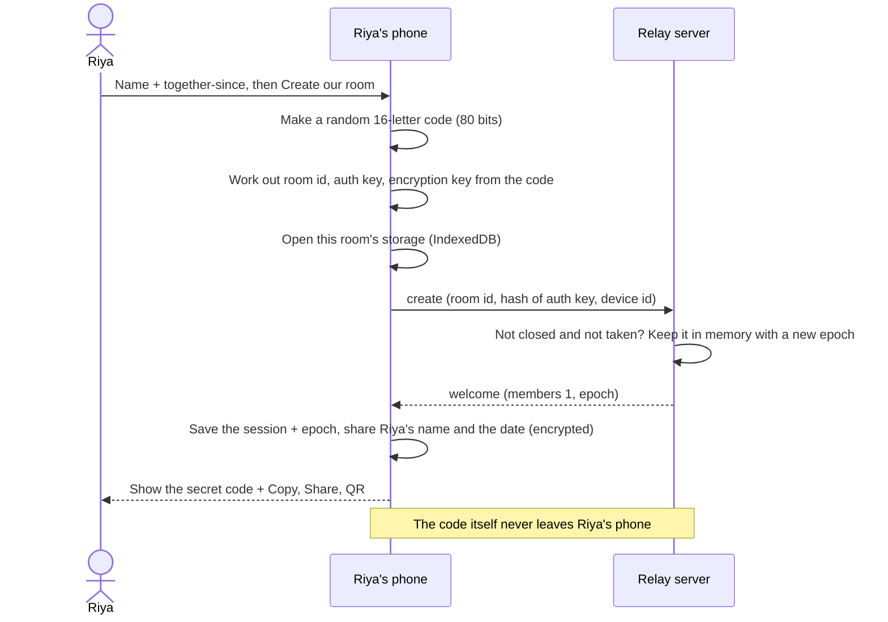
```mermaid
sequenceDiagram
    actor Riya
    participant App as Riya's phone
    participant Relay as Relay server
    Riya->>App: Name + together-since, then Create our room
    App->>App: Make a random 16-letter code (80 bits)
    App->>App: Work out room id, auth key, encryption key from the code
    App->>App: Open this room's storage (IndexedDB)
    App->>Relay: create (room id, hash of auth key, device id)
    Relay->>Relay: Not closed and not taken? Keep it in memory with a new epoch
    Relay-->>App: welcome (members 1, epoch)
    App->>App: Save the session + epoch, share Riya's name and the date (encrypted)
    App-->>Riya: Show the secret code + Copy, Share, QR
    Note over App,Relay: The code itself never leaves Riya's phone
```

---

## 4.3 Join a room

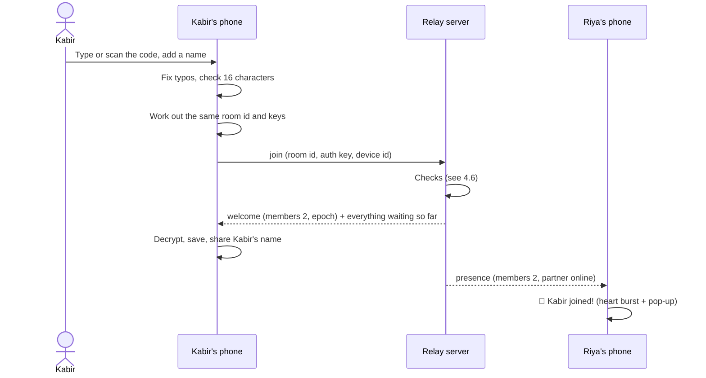
```mermaid
sequenceDiagram
    actor Kabir
    participant App as Kabir's phone
    participant Relay as Relay server
    participant Riya as Riya's phone
    Kabir->>App: Type or scan the code, add a name
    App->>App: Fix typos, check 16 characters
    App->>App: Work out the same room id and keys
    App->>Relay: join (room id, auth key, device id)
    Relay->>Relay: Checks (see 4.6)
    Relay-->>App: welcome (members 2, epoch) + everything waiting so far
    App->>App: Decrypt, save, share Kabir's name
    Relay-->>Riya: presence (members 2, partner online)
    Riya->>Riya: 💞 Kabir joined! (heart burst + pop-up)
```

---

## 4.4 Four keys from one secret code

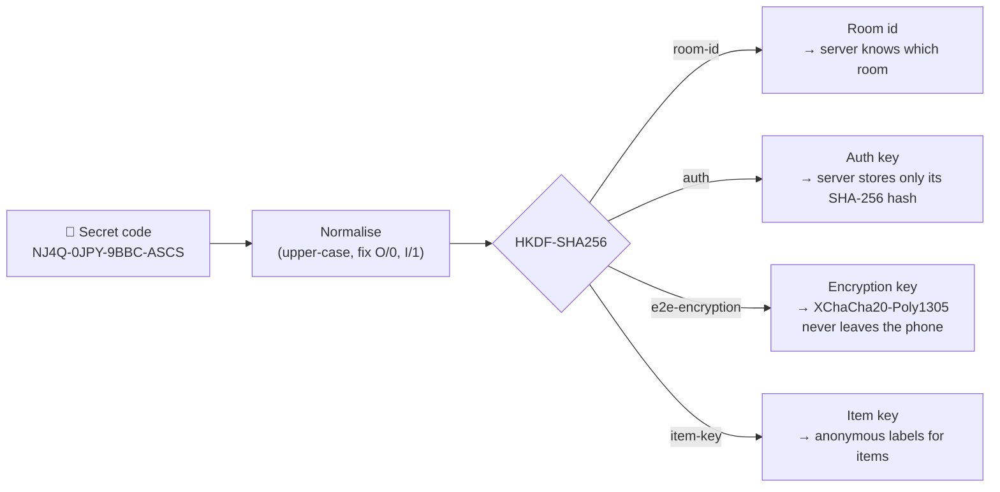
```mermaid
flowchart LR
    Code["🔑 Secret code<br/>NJ4Q-0JPY-9BBC-ASCS"] --> N["Normalise<br/>(upper-case, fix O/0, I/1)"]
    N --> H{"HKDF-SHA256"}
    H -->|"room-id"| R["Room id<br/>→ server knows which room"]
    H -->|"auth"| A["Auth key<br/>→ server stores only its SHA-256 hash"]
    H -->|"e2e-encryption"| E["Encryption key<br/>→ XChaCha20-Poly1305<br/>never leaves the phone"]
    H -->|"item-key"| M["Item key<br/>→ anonymous labels for items"]
```

---

## 4.5 How one message travels

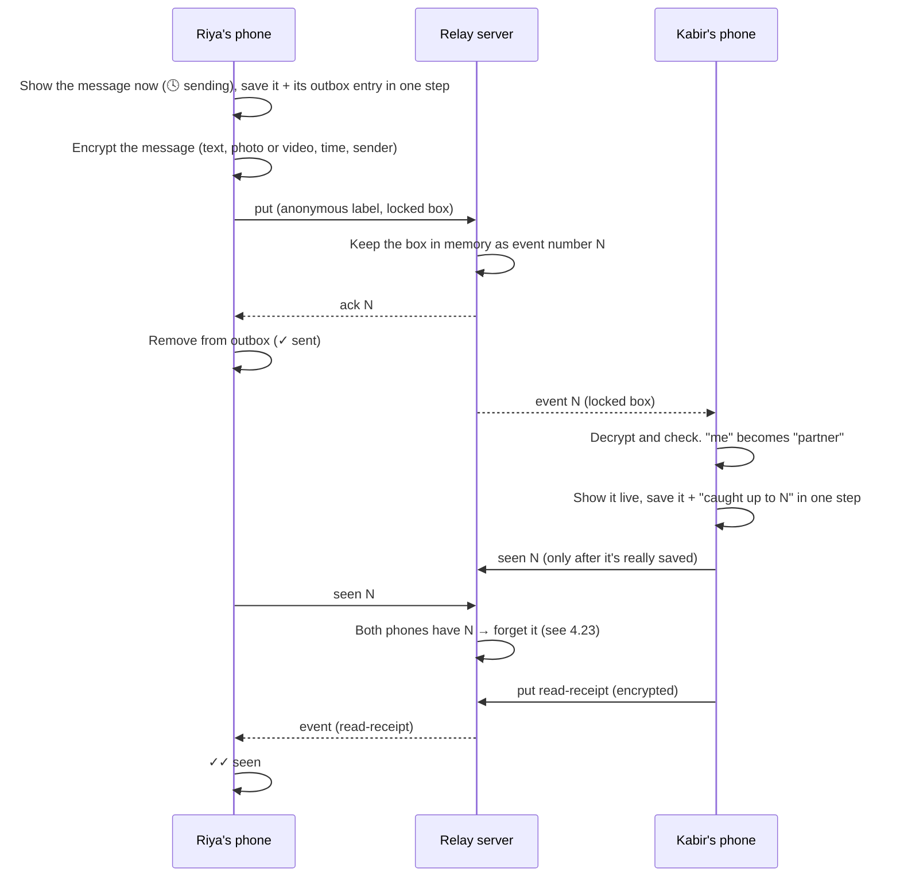
```mermaid
sequenceDiagram
    participant A as Riya's phone
    participant S as Relay server
    participant B as Kabir's phone
    A->>A: Show the message now (🕓 sending), save it + its outbox entry in one step
    A->>A: Encrypt the message (text, photo or video, time, sender)
    A->>S: put (anonymous label, locked box)
    S->>S: Keep the box in memory as event number N
    S-->>A: ack N
    A->>A: Remove from outbox (✓ sent)
    S-->>B: event N (locked box)
    B->>B: Decrypt and check. "me" becomes "partner"
    B->>B: Show it live, save it + "caught up to N" in one step
    B->>S: seen N (only after it's really saved)
    A->>S: seen N
    S->>S: Both phones have N → forget it (see 4.23)
    B->>S: put read-receipt (encrypted)
    S-->>A: event (read-receipt)
    A->>A: ✓✓ seen
```

---

## 4.6 What the server checks when someone joins

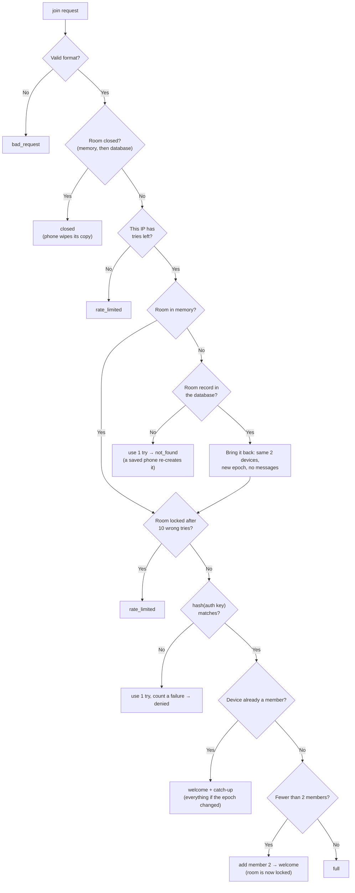
```mermaid
flowchart TD
    J["join request"] --> V{"Valid format?"}
    V -->|"No"| E1["bad_request"]
    V -->|"Yes"| C0{"Room closed?<br/>(memory, then database)"}
    C0 -->|"Yes"| EC["closed<br/>(phone wipes its copy)"]
    C0 -->|"No"| T{"This IP has<br/>tries left?"}
    T -->|"No"| E2["rate_limited"]
    T -->|"Yes"| F{"Room in memory?"}
    F -->|"No"| DBR{"Room record in<br/>the database?"}
    DBR -->|"Yes"| RES["Bring it back: same 2 devices,<br/>new epoch, no messages"]
    DBR -->|"No"| X1["use 1 try → not_found<br/>(a saved phone re-creates it)"]
    F -->|"Yes"| L
    RES --> L{"Room locked after<br/>10 wrong tries?"}
    L -->|"Yes"| E3["rate_limited"]
    L -->|"No"| K{"hash(auth key)<br/>matches?"}
    K -->|"No"| X2["use 1 try, count a failure → denied"]
    K -->|"Yes"| M{"Device already a member?"}
    M -->|"Yes"| OK["welcome + catch-up<br/>(everything if the epoch changed)"]
    M -->|"No"| C{"Fewer than 2 members?"}
    C -->|"Yes"| ADD["add member 2 → welcome<br/>(room is now locked)"]
    C -->|"No"| FULL["full"]
```

---

## 4.7 Offline, server restarts and catch-up

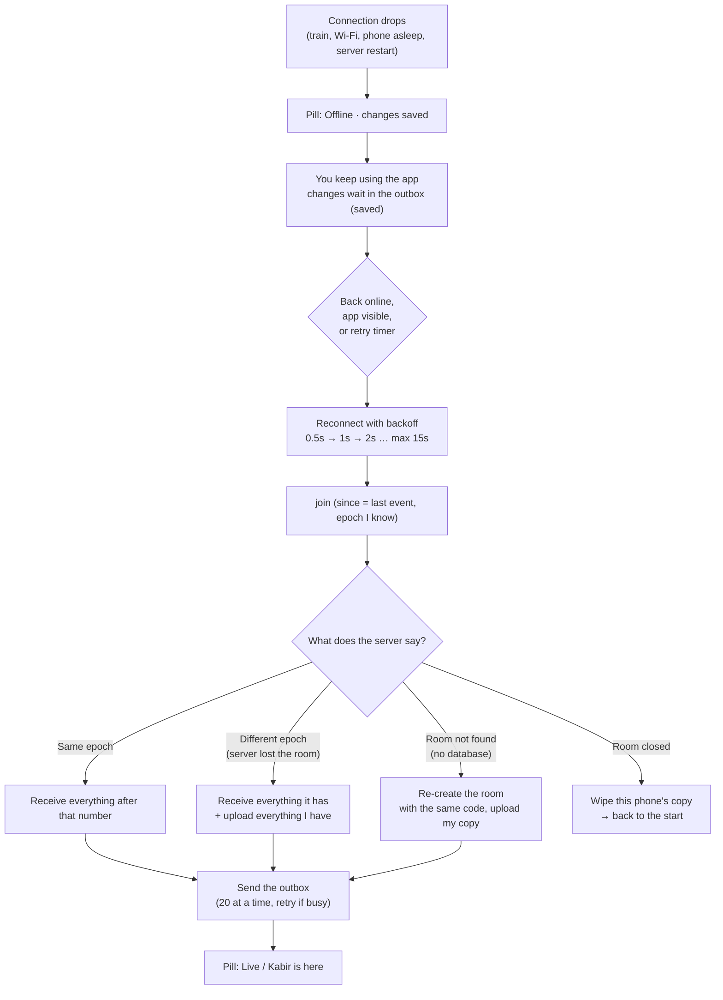
```mermaid
flowchart TD
    A["Connection drops<br/>(train, Wi-Fi, phone asleep, server restart)"] --> B["Pill: Offline · changes saved"]
    B --> C["You keep using the app<br/>changes wait in the outbox (saved)"]
    C --> D{"Back online,<br/>app visible,<br/>or retry timer"}
    D --> E["Reconnect with backoff<br/>0.5s → 1s → 2s … max 15s"]
    E --> F["join (since = last event, epoch I know)"]
    F --> G{"What does the server say?"}
    G -->|"Same epoch"| H["Receive everything after that number"]
    G -->|"Different epoch<br/>(server lost the room)"| I["Receive everything it has<br/>+ upload everything I have"]
    G -->|"Room not found<br/>(no database)"| R["Re-create the room<br/>with the same code, upload my copy"]
    G -->|"Room closed"| W["Wipe this phone's copy<br/>→ back to the start"]
    H --> K["Send the outbox<br/>(20 at a time, retry if busy)"]
    I --> K
    R --> K
    K --> L["Pill: Live / Kabir is here"]
```

---

## 4.8 How the app starts

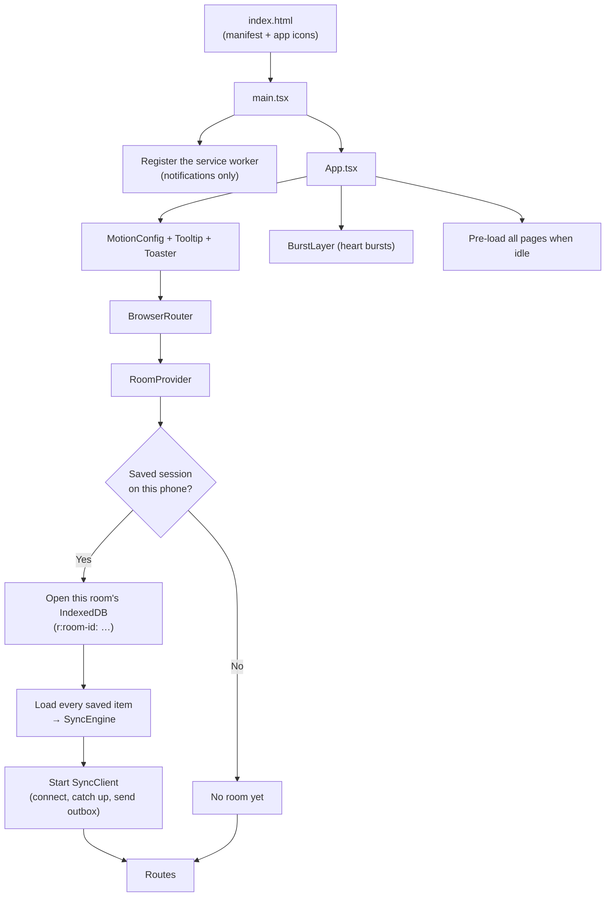
```mermaid
flowchart TD
    A["index.html<br/>(manifest + app icons)"] --> B["main.tsx"]
    B --> SW["Register the service worker<br/>(notifications only)"]
    B --> C["App.tsx"]
    C --> D["MotionConfig + Tooltip + Toaster"]
    D --> E["BrowserRouter"]
    E --> F["RoomProvider"]
    F --> G{"Saved session<br/>on this phone?"}
    G -->|"Yes"| H["Open this room's IndexedDB<br/>(r:room-id: …)"]
    H --> H2["Load every saved item<br/>→ SyncEngine"]
    H2 --> H3["Start SyncClient<br/>(connect, catch up, send outbox)"]
    G -->|"No"| I["No room yet"]
    H3 --> J["Routes"]
    I --> J
    C --> K["BurstLayer (heart bursts)"]
    C --> L["Pre-load all pages when idle"]
```

---

## 4.9 Page map and the room guard

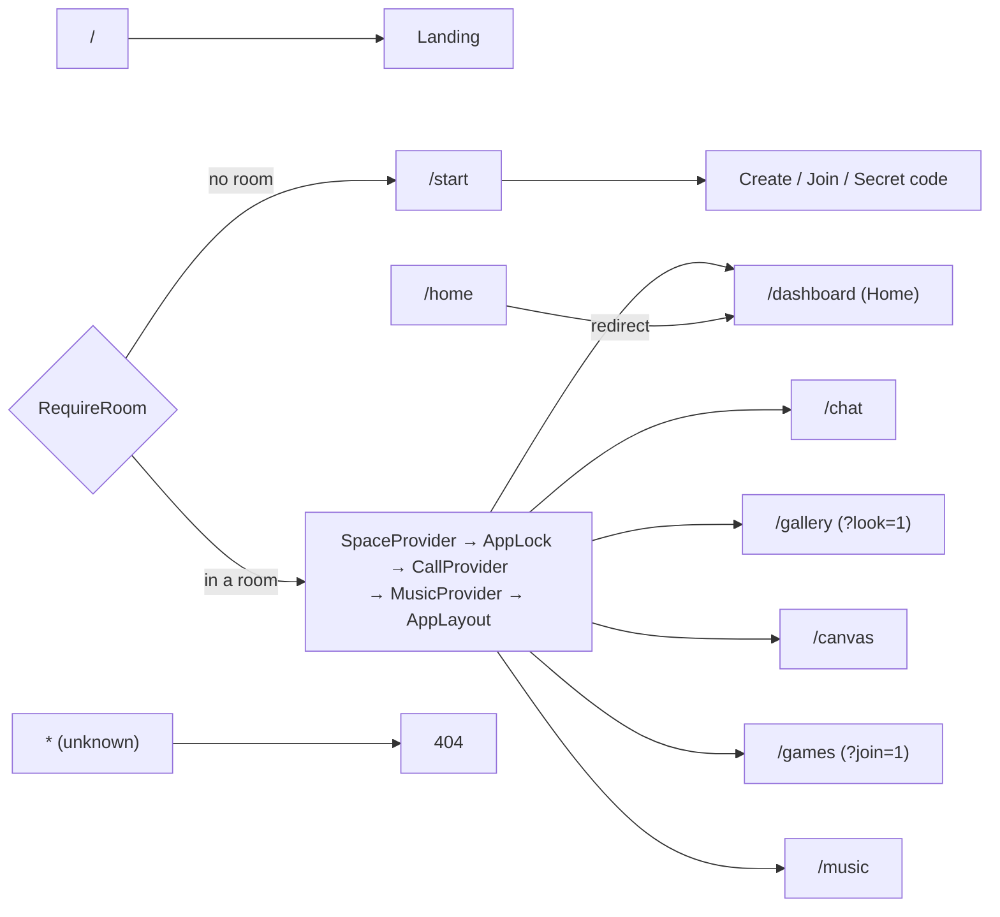
```mermaid
flowchart LR
    Root["/"] --> Landing["Landing"]
    StartP["/start"] --> Start["Create / Join / Secret code"]
    Guard{"RequireRoom"}
    Guard -->|"no room"| StartP
    Guard -->|"in a room"| Layout["SpaceProvider → AppLock → CallProvider<br/>→ MusicProvider → AppLayout"]
    Layout --> D["/dashboard (Home)"]
    Layout --> C["/chat"]
    Layout --> G["/gallery (?look=1)"]
    Layout --> CV["/canvas"]
    Layout --> GM["/games (?join=1)"]
    Layout --> M["/music"]
    HomeAlias["/home"] -->|"redirect"| D
    Star["* (unknown)"] --> NF["404"]
```

---

## 4.10 Screen layout (component tree)

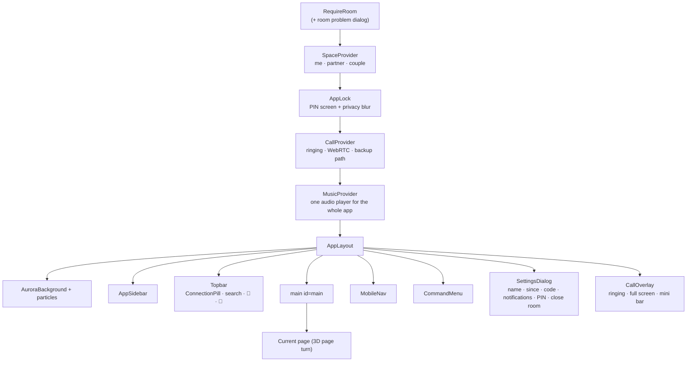
```mermaid
flowchart TD
    RR["RequireRoom<br/>(+ room problem dialog)"] --> SP["SpaceProvider<br/>me · partner · couple"]
    SP --> LK["AppLock<br/>PIN screen + privacy blur"]
    LK --> CP["CallProvider<br/>ringing · WebRTC · backup path"]
    CP --> MP["MusicProvider<br/>one audio player for the whole app"]
    MP --> AL["AppLayout"]
    AL --> AB["AuroraBackground + particles"]
    AL --> AS["AppSidebar"]
    AL --> TB["Topbar<br/>ConnectionPill · search · 🎵 · 💖"]
    AL --> MAIN["main id=main"]
    MAIN --> PAGE["Current page (3D page turn)"]
    AL --> MN["MobileNav"]
    AL --> CM["CommandMenu"]
    AL --> SD["SettingsDialog<br/>name · since · code · notifications · PIN · close room"]
    AL --> CO["CallOverlay<br/>ringing · full screen · mini bar"]
```

---

## 4.11 Shared data: newest wins and pop-ups

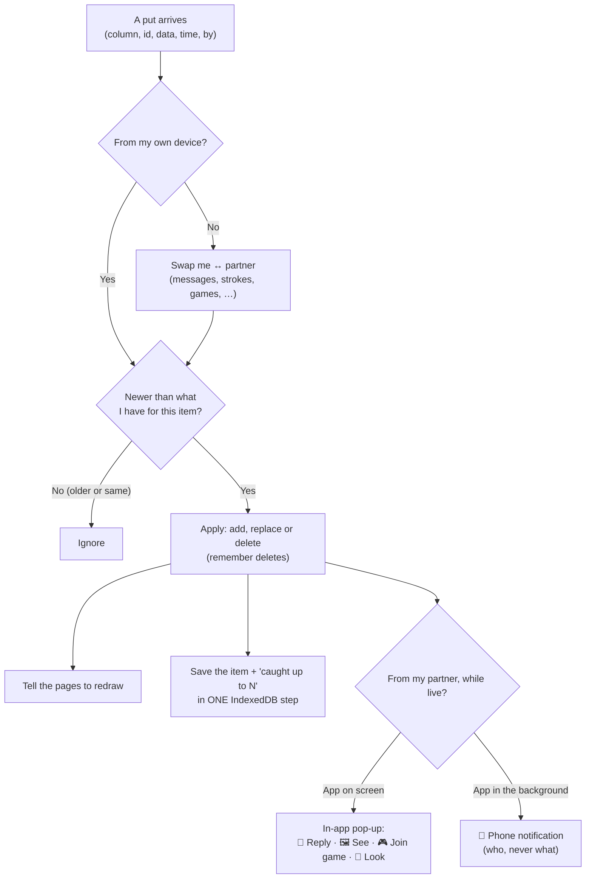
```mermaid
flowchart TD
    P["A put arrives<br/>(column, id, data, time, by)"] --> W{"From my own device?"}
    W -->|"No"| F["Swap me ↔ partner<br/>(messages, strokes, games, …)"]
    W -->|"Yes"| N
    F --> N{"Newer than what<br/>I have for this item?"}
    N -->|"No (older or same)"| I["Ignore"]
    N -->|"Yes"| A["Apply: add, replace or delete<br/>(remember deletes)"]
    A --> U["Tell the pages to redraw"]
    A --> S["Save the item + 'caught up to N'<br/>in ONE IndexedDB step"]
    A --> T{"From my partner, while live?"}
    T -->|"App on screen"| T1["In-app pop-up:<br/>💬 Reply · 🖼️ See · 🎮 Join game · 👀 Look"]
    T -->|"App in the background"| T2["🔔 Phone notification<br/>(who, never what)"]
```

---

## 4.12 Chat: typing, sending and ticks

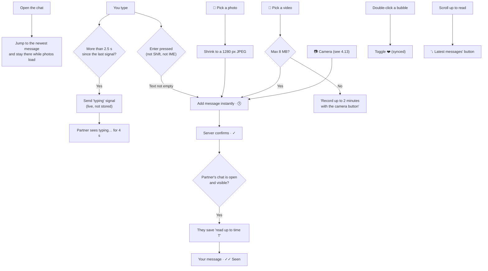
```mermaid
flowchart TD
    O["Open the chat"] --> O2["Jump to the newest message<br/>and stay there while photos load"]
    A["You type"] --> B{"More than 2.5 s<br/>since the last signal?"}
    B -->|"Yes"| C["Send 'typing' signal<br/>(live, not stored)"]
    C --> D["Partner sees typing… for 4 s"]
    A --> E{"Enter pressed<br/>(not Shift, not IME)"}
    E -->|"Text not empty"| F["Add message instantly · 🕓"]
    F --> G["Server confirms · ✓"]
    G --> H{"Partner's chat is open<br/>and visible?"}
    H -->|"Yes"| I["They save 'read up to time T'"]
    I --> J["Your message · ✓✓ Seen"]
    K["📎 Pick a photo"] --> L["Shrink to a 1280 px JPEG"] --> F
    K2["📎 Pick a video"] --> L2{"Max 8 MB?"}
    L2 -->|"Yes"| F
    L2 -->|"No"| L3["'Record up to 2 minutes<br/>with the camera button'"]
    CAM["📷 Camera (see 4.13)"] --> F
    M["Double-click a bubble"] --> N["Toggle ❤️ (synced)"]
    UP["Scroll up to read"] --> UP2["'↓ Latest messages' button"]
```

---

## 4.13 Camera: photo or video

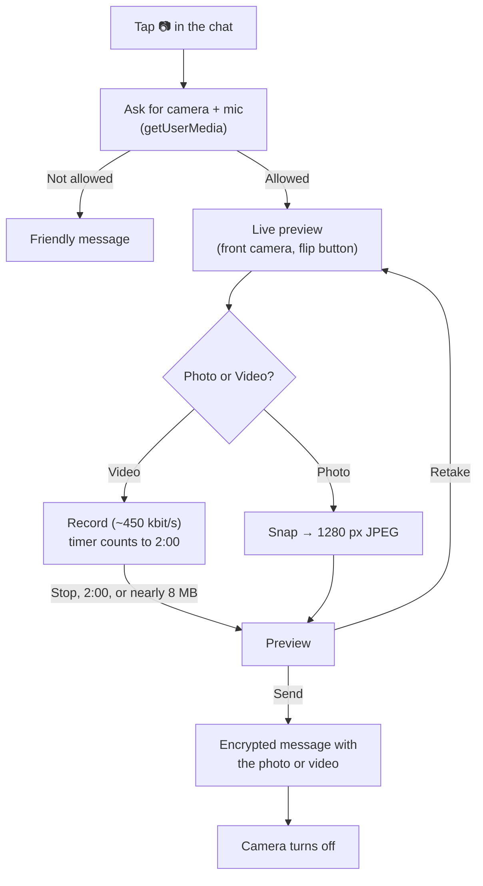
```mermaid
flowchart TD
    A["Tap 📷 in the chat"] --> B["Ask for camera + mic<br/>(getUserMedia)"]
    B -->|"Not allowed"| X["Friendly message"]
    B -->|"Allowed"| C["Live preview<br/>(front camera, flip button)"]
    C --> D{"Photo or Video?"}
    D -->|"Photo"| E["Snap → 1280 px JPEG"]
    D -->|"Video"| F["Record (~450 kbit/s)<br/>timer counts to 2:00"]
    F -->|"Stop, 2:00, or nearly 8 MB"| H["Preview"]
    E --> H
    H -->|"Retake"| C
    H -->|"Send"| I["Encrypted message with<br/>the photo or video"]
    I --> J["Camera turns off"]
```

---

## 4.14 I'm missing you

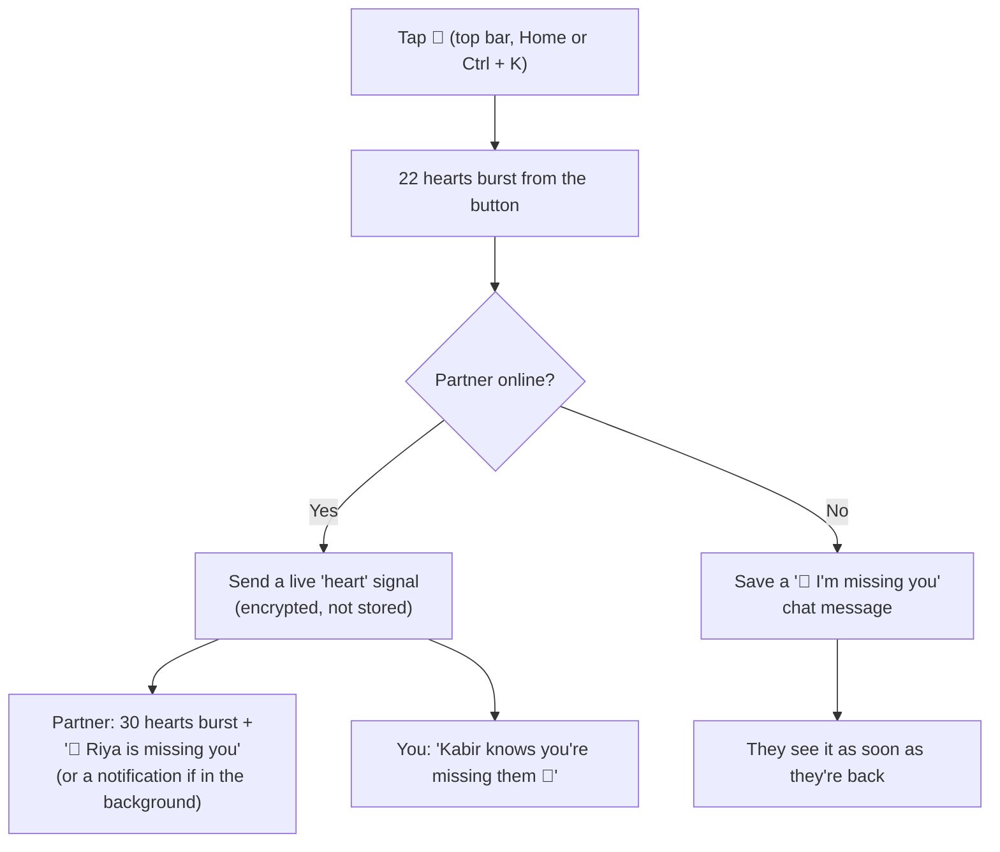
```mermaid
flowchart TD
    A["Tap 💖 (top bar, Home or Ctrl + K)"] --> B["22 hearts burst from the button"]
    B --> C{"Partner online?"}
    C -->|"Yes"| D["Send a live 'heart' signal<br/>(encrypted, not stored)"]
    D --> E["Partner: 30 hearts burst +<br/>'💖 Riya is missing you'<br/>(or a notification if in the background)"]
    D --> F["You: 'Kabir knows you're missing them 💖'"]
    C -->|"No"| G["Save a '💖 I'm missing you'<br/>chat message"]
    G --> H["They see it as soon as they're back"]
```

---

## 4.15 A call, step by step

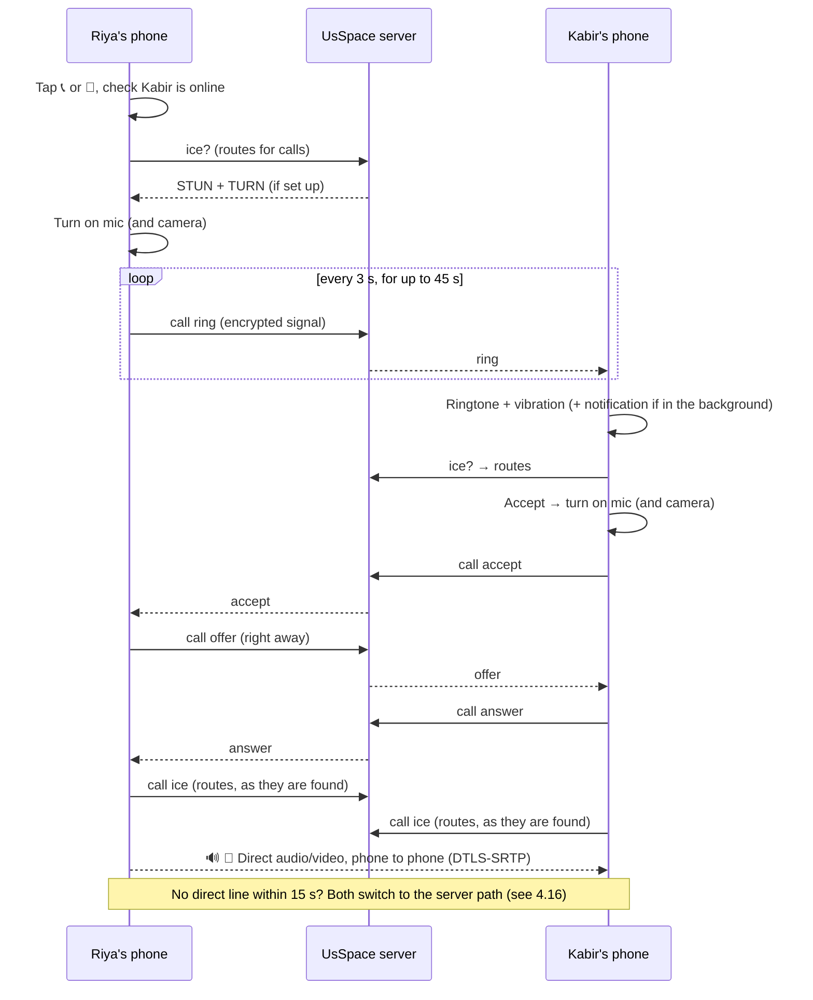
```mermaid
sequenceDiagram
    participant A as Riya's phone
    participant S as UsSpace server
    participant B as Kabir's phone
    A->>A: Tap 📞 or 🎥, check Kabir is online
    A->>S: ice? (routes for calls)
    S-->>A: STUN + TURN (if set up)
    A->>A: Turn on mic (and camera)
    loop every 3 s, for up to 45 s
        A->>S: call ring (encrypted signal)
        S-->>B: ring
    end
    B->>B: Ringtone + vibration (+ notification if in the background)
    B->>S: ice? → routes
    B->>B: Accept → turn on mic (and camera)
    B->>S: call accept
    S-->>A: accept
    A->>S: call offer (right away)
    S-->>B: offer
    B->>S: call answer
    S-->>A: answer
    A->>S: call ice (routes, as they are found)
    B->>S: call ice (routes, as they are found)
    A-->>B: 🔊 🎥 Direct audio/video, phone to phone (DTLS-SRTP)
    Note over A,B: No direct line within 15 s? Both switch to the server path (see 4.16)
```

**Special cases:** no answer in 45 s → "Kabir didn't answer". Decline → "Kabir can't talk right now". Already on a call → "busy". Both call at the same moment → one phone answers the other call automatically. Closing the page → the call ends. Missed call → a notification.

---

## 4.16 Direct, repaired or through the server

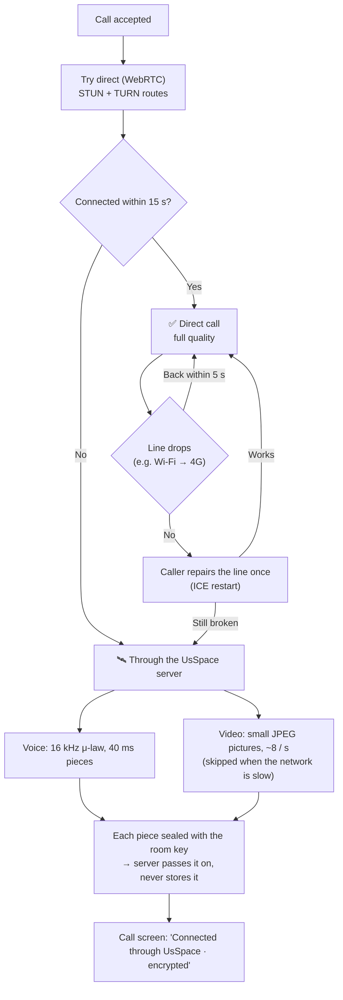
```mermaid
flowchart TD
    S["Call accepted"] --> D["Try direct (WebRTC)<br/>STUN + TURN routes"]
    D --> Q{"Connected within 15 s?"}
    Q -->|"Yes"| OK["✅ Direct call<br/>full quality"]
    Q -->|"No"| R["🛰️ Through the UsSpace server"]
    OK --> DROP{"Line drops<br/>(e.g. Wi-Fi → 4G)"}
    DROP -->|"Back within 5 s"| OK
    DROP -->|"No"| FIX["Caller repairs the line once<br/>(ICE restart)"]
    FIX -->|"Works"| OK
    FIX -->|"Still broken"| R
    R --> V["Voice: 16 kHz μ-law, 40 ms pieces"]
    R --> P["Video: small JPEG pictures, ~8 / s<br/>(skipped when the network is slow)"]
    V & P --> E["Each piece sealed with the room key<br/>→ server passes it on, never stores it"]
    E --> CH["Call screen: 'Connected through UsSpace · encrypted'"]
```

---

## 4.17 Call screen states

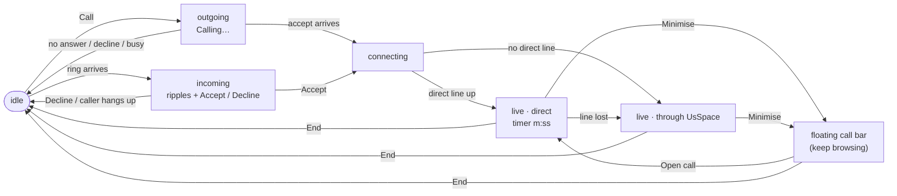
```mermaid
flowchart LR
    Idle(["idle"]) -->|"Call"| Out["outgoing<br/>Calling…"]
    Idle -->|"ring arrives"| In["incoming<br/>ripples + Accept / Decline"]
    Out -->|"accept arrives"| Con["connecting"]
    In -->|"Accept"| Con
    Con -->|"direct line up"| Live["live · direct<br/>timer m:ss"]
    Con -->|"no direct line"| Relay["live · through UsSpace"]
    Live -->|"line lost"| Relay
    Live -->|"Minimise"| Mini["floating call bar<br/>(keep browsing)"]
    Relay -->|"Minimise"| Mini
    Mini -->|"Open call"| Live
    Out -->|"no answer / decline / busy"| Idle
    In -->|"Decline / caller hangs up"| Idle
    Live -->|"End"| Idle
    Relay -->|"End"| Idle
    Mini -->|"End"| Idle
```

---

## 4.18 Gallery: share, show and talk

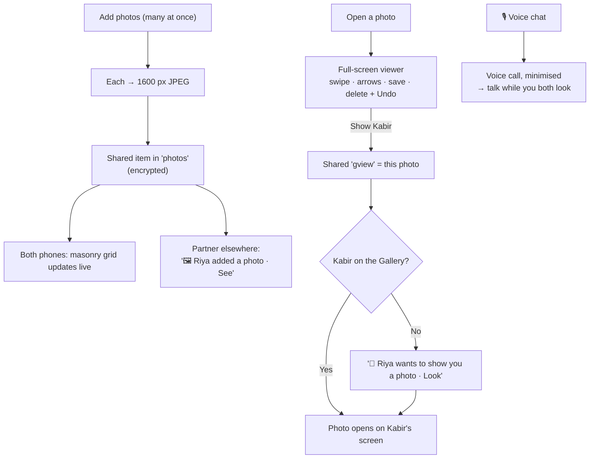
```mermaid
flowchart TD
    A["Add photos (many at once)"] --> B["Each → 1600 px JPEG"]
    B --> C["Shared item in 'photos'<br/>(encrypted)"]
    C --> D["Both phones: masonry grid updates live"]
    C --> E["Partner elsewhere:<br/>'🖼️ Riya added a photo · See'"]
    F["Open a photo"] --> G["Full-screen viewer<br/>swipe · arrows · save · delete + Undo"]
    G -->|"Show Kabir"| H["Shared 'gview' = this photo"]
    H --> I{"Kabir on the Gallery?"}
    I -->|"Yes"| J["Photo opens on Kabir's screen"]
    I -->|"No"| K["'👀 Riya wants to show you a photo · Look'"]
    K --> J
    V["🎙️ Voice chat"] --> W["Voice call, minimised<br/>→ talk while you both look"]
```

---

## 4.19 Canvas: a board that grows

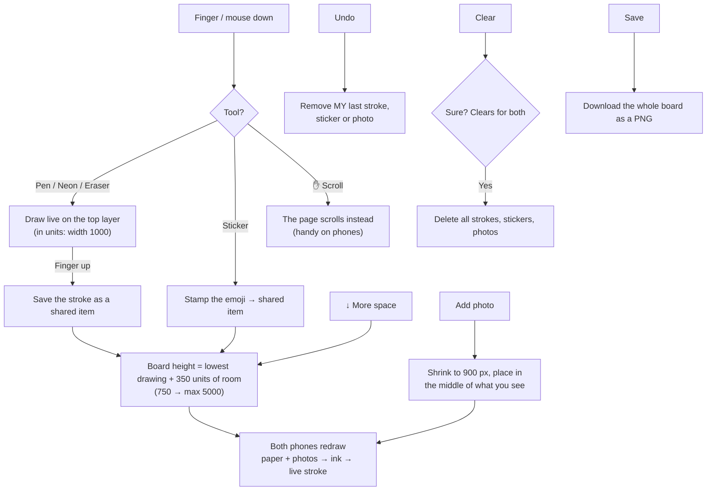
```mermaid
flowchart TD
    A["Finger / mouse down"] --> B{"Tool?"}
    B -->|"Pen / Neon / Eraser"| C["Draw live on the top layer<br/>(in units: width 1000)"]
    C -->|"Finger up"| D["Save the stroke as a shared item"]
    B -->|"Sticker"| E["Stamp the emoji → shared item"]
    B -->|"✋ Scroll"| SC["The page scrolls instead<br/>(handy on phones)"]
    D & E --> H["Board height = lowest drawing + 350 units of room<br/>(750 → max 5000)"]
    H --> F["Both phones redraw<br/>paper + photos → ink → live stroke"]
    MS["↓ More space"] --> H
    P["Add photo"] --> Q["Shrink to 900 px, place in<br/>the middle of what you see"] --> F
    U["Undo"] --> U2["Remove MY last stroke,<br/>sticker or photo"]
    X["Clear"] --> X2{"Sure? Clears for both"} -->|"Yes"| X3["Delete all strokes, stickers, photos"]
    Y["Save"] --> Y2["Download the whole board as a PNG"]
```

---

## 4.20 Game invites

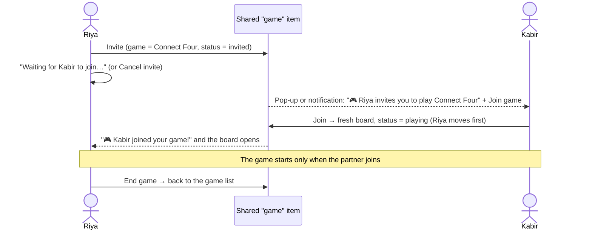
```mermaid
sequenceDiagram
    actor Riya
    participant G as Shared "game" item
    actor Kabir
    Riya->>G: Invite (game = Connect Four, status = invited)
    Riya->>Riya: "Waiting for Kabir to join…" (or Cancel invite)
    G-->>Kabir: Pop-up or notification: "🎮 Riya invites you to play Connect Four" + Join game
    Kabir->>G: Join → fresh board, status = playing (Riya moves first)
    G-->>Riya: "🎮 Kabir joined your game!" and the board opens
    Note over Riya,Kabir: The game starts only when the partner joins
    Riya->>G: End game → back to the game list
```

If Kabir is offline, Riya sees "Kabir is offline, they'll see your invite when they're back".

---

## 4.21 The 8 games

```mermaid
flowchart LR
    subgraph Turns["Take turns"]
      T1["❌⭕ Tic-Tac-Toe<br/>3 in a row"]
      T2["🔴 Connect Four<br/>drop hearts, 4 in a row<br/>(across, down, diagonal)"]
      T3["🧠 Memory Match<br/>find a pair → keep your turn"]
    end
    subgraph Secret["Pick in secret, then reveal"]
      S1["✂️ Rock Paper Scissors<br/>first to 3 wins"]
      S2["🙋 Never Have I Ever<br/>'I have' / 'Never'"]
      S3["🤔 Would You Rather<br/>match or not"]
      S4["💘 How Well Do You Know Me?<br/>one answers, one guesses,<br/>a right guess scores, then swap"]
    end
    subgraph Shared["Shared card"]
      C1["🎲 Truth or Dare<br/>the card flips on both phones"]
    end
```

Questions for the quiz, Never Have I Ever and Would You Rather come in the **same shuffled order on both phones** (from a shared seed).

---

## 4.22 Music: one player, in sync

```mermaid
flowchart TD
    F["📁 front-end/public/music<br/>(your mp3, m4a, ogg, wav, flac…)"] --> MF["Server lists it at<br/>/music/manifest.json"]
    MF --> SONGS["MusicProvider: song list<br/>(one player for the whole app)"]
    D["Shared player item<br/>{song, playing, position, at}"] --> N["Each phone: now = server time"]
    N --> P{"playing?"}
    P -->|"Yes"| Q["position + (now − at)"]
    P -->|"No"| R["position"]
    Q & R --> AU["Own audio element<br/>(corrects if more than 1.5 s off)"]
    SONGS --> AU
    AU --> RNG["Streams only while playing<br/>(Range 206)"]
    C1["Music page · 🎵 top-bar pop-up<br/>lock screen / headphones"] -->|"Play · Pause · Seek · Next · Prev"| S["Write {position at now, at = now}"]
    S --> D
    E{"Song ended?"} -->|"repeat one"| S1["position 0"]
    E -->|"last song, repeat off"| S2["stop"]
    E -->|"otherwise"| S3["next (or random with shuffle)"]
    AU -.->|"browser blocks autoplay"| TAP["'Tap to hear it here'"]
```

---

## 4.23 The server forgets what both phones have

```mermaid
flowchart TD
    A["Event N arrives at the server"] --> B["Kept in memory<br/>(max 80 MB per room, 320 MB in total)"]
    B --> C["Sent to both phones"]
    C --> D["Each phone saves it,<br/>then says 'seen N'"]
    D --> E{"BOTH phones<br/>have seen N?"}
    E -->|"Yes"| F["Drop everything up to N"]
    E -->|"No (partner offline)"| B
    G["A new phone takes the free seat"] --> H{"Older events already dropped?"}
    H -->|"Yes"| I["Server asks the other phone:<br/>'resync' → it uploads everything again"]
    H -->|"No"| J["The new phone simply catches up"]
```

---

## 4.24 PIN lock and privacy blur

```mermaid
flowchart TD
    S["Settings → PIN lock on"] --> H["PIN → PBKDF2-SHA256<br/>150 000 rounds + random salt"]
    H --> K["Save only the hash on this phone"]
    O["App opens"] --> L{"PIN set?"}
    L -->|"Yes"| LS["🔒 UsSpace is locked"]
    L -->|"No"| APP["App"]
    LS --> E{"Correct PIN?"}
    E -->|"Yes"| APP
    E -->|"No"| F{"5 wrong tries?"}
    F -->|"Yes"| W["Wait 30 seconds"]
    F -->|"No"| SH["Card shakes, try again"]
    APP --> BG["App goes to the background"]
    BG --> BL["Blur the whole app<br/>(app switcher, screen share)"]
    BG --> BK{"Back after more than 30 s<br/>and PIN set?"}
    BK -->|"Yes"| LS
    BK -->|"No"| APP
```

---

## 4.25 Close room = delete everything

```mermaid
sequenceDiagram
    actor Riya
    participant A as Riya's phone
    participant S as Relay
    participant DB as Database (optional)
    participant B as Kabir's phone
    Riya->>A: Settings → Close room & delete everything → Confirm
    alt Riya is offline
        A-->>Riya: "You're offline — connect to close the room for both of you"
    else Riya is online
        A->>S: close
        S->>S: Delete the room from memory, remember "closed"
        S->>DB: closed:room (180 days) · delete the room record
        S-->>A: closed
        S-->>B: closed
        A->>A: Wipe IndexedDB + local storage for this room
        B->>B: Wipe IndexedDB + local storage for this room
        A-->>Riya: "🔒 The room was closed. Everything was deleted."
    end
    Note over S,B: If Kabir was offline, Kabir's phone gets "closed" on reconnect and wipes then — even after a server restart when the database is on. Nobody can re-create a closed room.
```

---

## 4.26 Leave on this phone only

```mermaid
flowchart TD
    A["Settings → Leave on this phone only"] --> B{"Confirm"}
    B -->|"Stay"| Z["Nothing changes"]
    B -->|"Leave"| C["Tell the server: leave"]
    C --> D["Server frees this seat<br/>(the room stays for your partner)"]
    C --> E["Wipe this phone's copy + session"]
    E --> F["Back to the landing page"]
    D --> G["You can join again later with the code<br/>(the other phone re-sends everything)"]
```

---

## 4.27 Notifications

```mermaid
flowchart TD
    I["Add UsSpace to the home screen<br/>(manifest + icons)"] --> S["Settings → Notifications → Turn on"]
    S --> P{"Browser allows it?"}
    P -->|"No"| N["'Blocked in your browser settings'"]
    P -->|"Yes"| ON["On for this phone"]
    E["Something happens<br/>(ring, message, photo, heart, invite)"] --> V{"Is UsSpace on screen?"}
    V -->|"Yes"| T["In-app pop-up only"]
    V -->|"No, in the background"| W["Service worker shows a notification<br/>'📞 Kabir is calling…' · '💬 Kabir — New message'"]
    W --> TAP["Tap it → UsSpace opens<br/>on the right page"]
```

The service worker caches nothing, and notifications never show what a message says.

---

## 4.28 Quick search (Ctrl + K)

```mermaid
flowchart LR
    A["Ctrl/⌘ + K"] --> B["Command menu"]
    B --> C{"Choice"}
    C -->|"A room"| D["Go there"]
    C -->|"I'm missing you"| E["💖 (see 4.14)"]
    C -->|"Video call / Voice call"| F["📞 (see 4.15)"]
    C -->|"Add photos"| G["/gallery"]
    C -->|"Draw together"| H["/canvas"]
    C -->|"Invite to a game"| I["/games"]
    C -->|"Profile, room code & settings"| J["Settings dialog"]
```

---

## 4.29 Phone navigation

```mermaid
flowchart LR
    A["Bottom dock"] --> H["Home"]
    A --> C["Chat"]
    A --> G["Gallery"]
    A --> GM["Games"]
    A --> M["More"]
    M --> S["Slide-in menu with every room<br/>(Canvas, Music, …)"]
    T["Top bar (every page)"] --> T1["🎵 music pop-up"]
    T --> T2["💖 missing you"]
    T --> T3["Connection pill"]
```

---

## 4.30 Running it for real (deployment)

```mermaid
flowchart LR
    Dev["npm run dev<br/>(site + relay + music on :8080)"] --> Build["npm run build → dist/<br/>(+ dist/music)"]
    Build --> Start["npm start<br/>server/index.mjs"]
    Start --> Serve["Serves dist/ with security headers,<br/>gzip and seekable music"]
    Start --> WS["Relay on /ws<br/>rooms in memory, call backup path"]
    Docker["Dockerfile"] --> Start
    Serve & WS --> HTTPS["Behind HTTPS<br/>(Render free, Railway, Fly.io, a VPS…)"]
    HTTPS --> Phones["📱 📱 Both phones open the same address"]
    TURN["Optional: Cloudflare TURN<br/>CLOUDFLARE_TURN_*"] -.-> WS
    DB["Optional: Upstash<br/>UPSTASH_REDIS_REST_*"] -.-> WS
```

**Back:** [← 3 · Design](03-design.md) · **Next:** [5 · Directory Map →](05-directory-map.md)
