# 4 · Flowcharts of Everything

Every important flow in UsSpace, drawn as a picture.
The diagrams use **Mermaid**, which GitHub and VS Code (with a Mermaid preview extension) draw automatically.

**Contents**

1. [The big picture (user journey)](#41-the-big-picture-user-journey)
2. [Create a room](#42-create-a-room)
3. [Join a room](#43-join-a-room)
4. [Four keys from one secret code](#44-four-keys-from-one-secret-code)
5. [How one message travels](#45-how-one-message-travels)
6. [What the server checks when someone joins](#46-what-the-server-checks-when-someone-joins)
7. [Offline, reconnect and catch-up](#47-offline-reconnect-and-catch-up)
8. [How the app starts](#48-how-the-app-starts)
9. [Page map and the room guard](#49-page-map-and-the-room-guard)
10. [Screen layout (component tree)](#410-screen-layout-component-tree)
11. [Shared data: newest wins](#411-shared-data-newest-wins)
12. [Chat: typing, sending and ticks](#412-chat-typing-sending-and-ticks)
13. [Hearts, nudges and presence](#413-hearts-nudges-and-presence)
14. [Two-player tic-tac-toe](#414-two-player-tic-tac-toe)
15. [Memory Match, Truth or Dare, Would You Rather](#415-memory-match-truth-or-dare-would-you-rather)
16. [Planner](#416-planner)
17. [Shared music timeline](#417-shared-music-timeline)
18. [Love letters](#418-love-letters)
19. [Timeline](#419-timeline)
20. [Quick search (Ctrl + K)](#420-quick-search-ctrl--k)
21. [Delete with Undo](#421-delete-with-undo)
22. [Leave the room](#422-leave-the-room)
23. [Phone navigation](#423-phone-navigation)
24. [Running it for real (deployment)](#424-running-it-for-real-deployment)

---

## 4.1 The big picture (user journey)

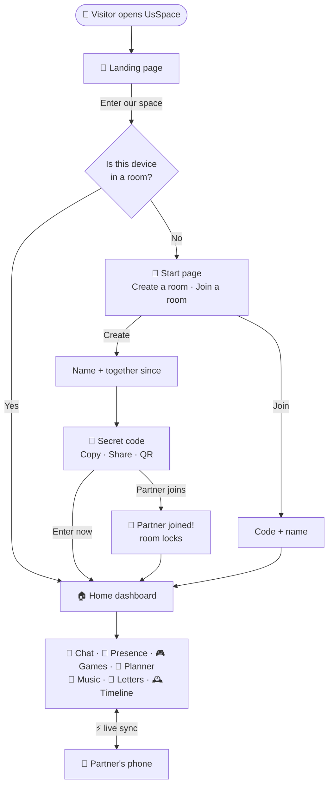
```mermaid
flowchart TD
    Start(["👤 Visitor opens UsSpace"]) --> Landing["🌌 Landing page"]
    Landing -->|"Enter our space"| Gate{"Is this device<br/>in a room?"}
    Gate -->|"Yes"| Home["🏠 Home dashboard"]
    Gate -->|"No"| Choose["🔐 Start page<br/>Create a room · Join a room"]
    Choose -->|"Create"| Create["Name + together since"] --> Code["🔑 Secret code<br/>Copy · Share · QR"]
    Code -->|"Partner joins"| Joined["💞 Partner joined!<br/>room locks"]
    Code -->|"Enter now"| Home
    Joined --> Home
    Choose -->|"Join"| Join["Code + name"] --> Home
    Home --> Rooms["💬 Chat · 👥 Presence · 🎮 Games · 📅 Planner<br/>🎵 Music · 💌 Letters · 🕰️ Timeline"]
    Rooms <-->|"⚡ live sync"| Partner["📱 Partner's phone"]
```

---

## 4.2 Create a room

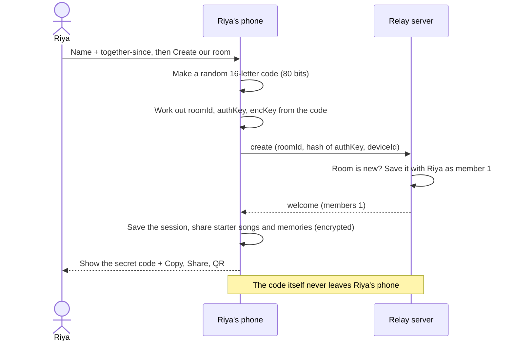
```mermaid
sequenceDiagram
    actor Riya
    participant App as Riya's phone
    participant Relay as Relay server
    Riya->>App: Name + together-since, then Create our room
    App->>App: Make a random 16-letter code (80 bits)
    App->>App: Work out roomId, authKey, encKey from the code
    App->>Relay: create (roomId, hash of authKey, deviceId)
    Relay->>Relay: Room is new? Save it with Riya as member 1
    Relay-->>App: welcome (members 1)
    App->>App: Save the session, share starter songs and memories (encrypted)
    App-->>Riya: Show the secret code + Copy, Share, QR
    Note over App,Relay: The code itself never leaves Riya's phone
```

---

## 4.3 Join a room

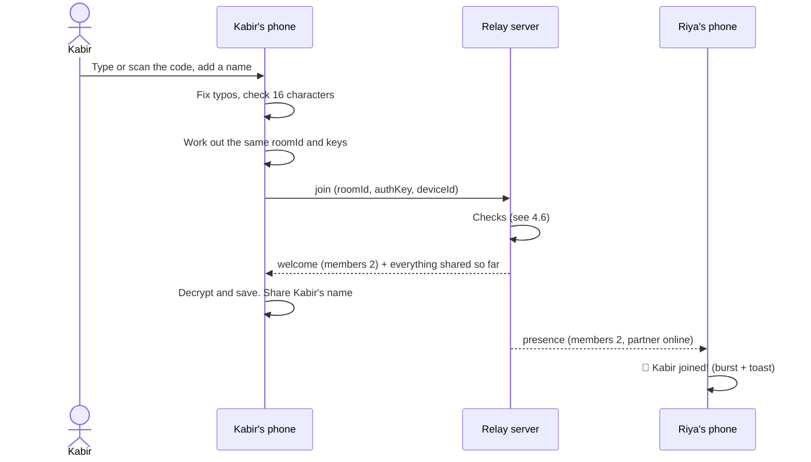
```mermaid
sequenceDiagram
    actor Kabir
    participant App as Kabir's phone
    participant Relay as Relay server
    participant Riya as Riya's phone
    Kabir->>App: Type or scan the code, add a name
    App->>App: Fix typos, check 16 characters
    App->>App: Work out the same roomId and keys
    App->>Relay: join (roomId, authKey, deviceId)
    Relay->>Relay: Checks (see 4.6)
    Relay-->>App: welcome (members 2) + everything shared so far
    App->>App: Decrypt and save. Share Kabir's name
    Relay-->>Riya: presence (members 2, partner online)
    Riya->>Riya: 💞 Kabir joined! (burst + toast)
```

---

## 4.4 Four keys from one secret code

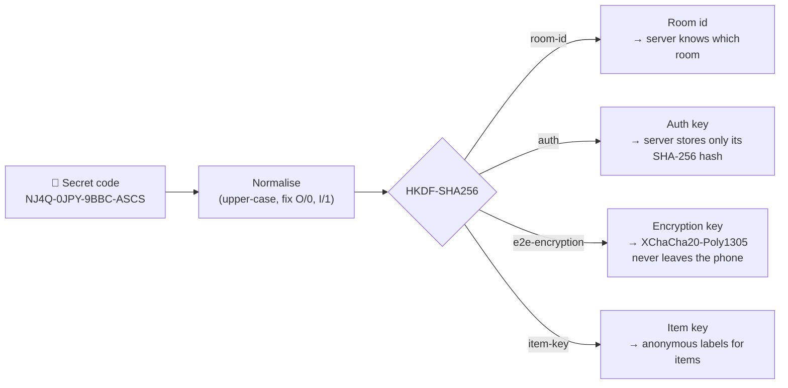
```mermaid
flowchart LR
    Code["🔑 Secret code<br/>NJ4Q-0JPY-9BBC-ASCS"] --> N["Normalise<br/>(upper-case, fix O/0, I/1)"]
    N --> H{"HKDF-SHA256"}
    H -->|"room-id"| R["Room id<br/>→ server knows which room"]
    H -->|"auth"| A["Auth key<br/>→ server stores only its SHA-256 hash"]
    H -->|"e2e-encryption"| E["Encryption key<br/>→ XChaCha20-Poly1305<br/>never leaves the phone"]
    H -->|"item-key"| M["Item key<br/>→ anonymous labels for items"]
```

---

## 4.5 How one message travels

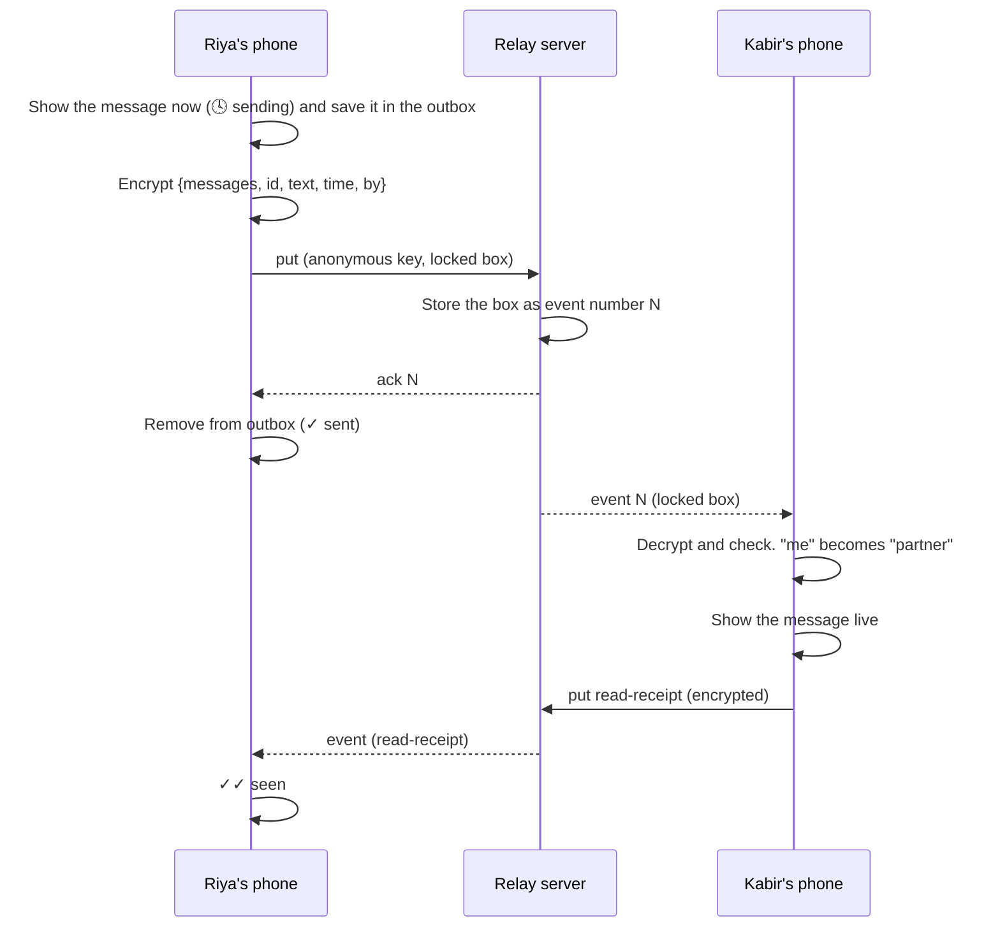
```mermaid
sequenceDiagram
    participant A as Riya's phone
    participant S as Relay server
    participant B as Kabir's phone
    A->>A: Show the message now (🕓 sending) and save it in the outbox
    A->>A: Encrypt {messages, id, text, time, by}
    A->>S: put (anonymous key, locked box)
    S->>S: Store the box as event number N
    S-->>A: ack N
    A->>A: Remove from outbox (✓ sent)
    S-->>B: event N (locked box)
    B->>B: Decrypt and check. "me" becomes "partner"
    B->>B: Show the message live
    B->>S: put read-receipt (encrypted)
    S-->>A: event (read-receipt)
    A->>A: ✓✓ seen
```

---

## 4.6 What the server checks when someone joins

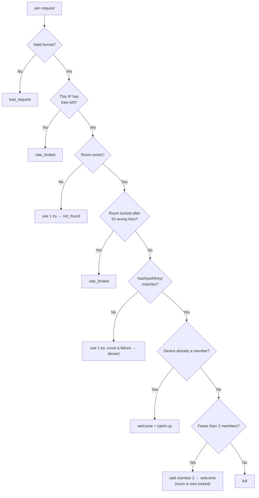
```mermaid
flowchart TD
    J["join request"] --> V{"Valid format?"}
    V -->|"No"| E1["bad_request"]
    V -->|"Yes"| T{"This IP has<br/>tries left?"}
    T -->|"No"| E2["rate_limited"]
    T -->|"Yes"| F{"Room exists?"}
    F -->|"No"| X1["use 1 try → not_found"]
    F -->|"Yes"| L{"Room locked after<br/>10 wrong tries?"}
    L -->|"Yes"| E3["rate_limited"]
    L -->|"No"| K{"hash(authKey)<br/>matches?"}
    K -->|"No"| X2["use 1 try, count a failure → denied"]
    K -->|"Yes"| M{"Device already a member?"}
    M -->|"Yes"| OK["welcome + catch-up"]
    M -->|"No"| C{"Fewer than 2 members?"}
    C -->|"Yes"| ADD["add member 2 → welcome<br/>(room is now locked)"]
    C -->|"No"| FULL["full"]
```

---

## 4.7 Offline, reconnect and catch-up

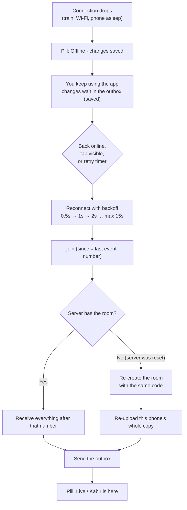
```mermaid
flowchart TD
    A["Connection drops<br/>(train, Wi-Fi, phone asleep)"] --> B["Pill: Offline · changes saved"]
    B --> C["You keep using the app<br/>changes wait in the outbox (saved)"]
    C --> D{"Back online,<br/>tab visible,<br/>or retry timer"}
    D --> E["Reconnect with backoff<br/>0.5s → 1s → 2s … max 15s"]
    E --> F["join (since = last event number)"]
    F --> G{"Server has the room?"}
    G -->|"Yes"| H["Receive everything after that number"]
    G -->|"No (server was reset)"| I["Re-create the room<br/>with the same code"]
    I --> J["Re-upload this phone's whole copy"]
    H --> K["Send the outbox"]
    J --> K
    K --> L["Pill: Live / Kabir is here"]
```

---

## 4.8 How the app starts

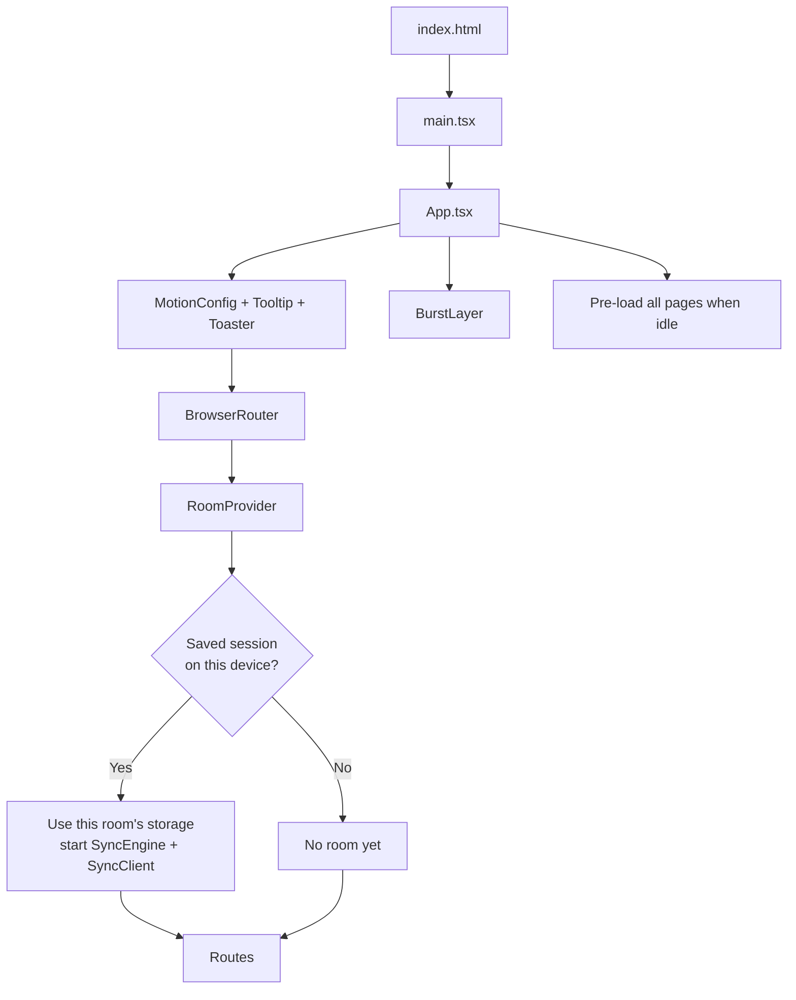
```mermaid
flowchart TD
    A["index.html"] --> B["main.tsx"]
    B --> C["App.tsx"]
    C --> D["MotionConfig + Tooltip + Toaster"]
    D --> E["BrowserRouter"]
    E --> F["RoomProvider"]
    F --> G{"Saved session<br/>on this device?"}
    G -->|"Yes"| H["Use this room's storage<br/>start SyncEngine + SyncClient"]
    G -->|"No"| I["No room yet"]
    H --> J["Routes"]
    I --> J
    C --> K["BurstLayer"]
    C --> L["Pre-load all pages when idle"]
```

---

## 4.9 Page map and the room guard

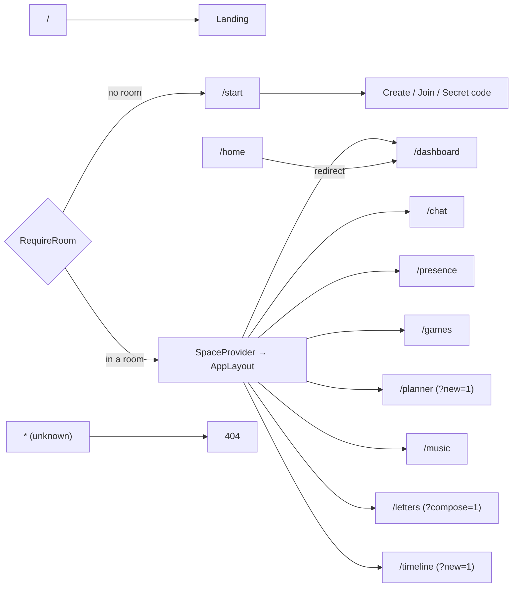
```mermaid
flowchart LR
    Root["/"] --> Landing["Landing"]
    StartP["/start"] --> Start["Create / Join / Secret code"]
    Guard{"RequireRoom"}
    Guard -->|"no room"| StartP
    Guard -->|"in a room"| Layout["SpaceProvider → AppLayout"]
    Layout --> D["/dashboard"]
    Layout --> C["/chat"]
    Layout --> P["/presence"]
    Layout --> G["/games"]
    Layout --> PL["/planner (?new=1)"]
    Layout --> M["/music"]
    Layout --> L["/letters (?compose=1)"]
    Layout --> T["/timeline (?new=1)"]
    HomeAlias["/home"] -->|"redirect"| D
    Star["* (unknown)"] --> NF["404"]
```

---

## 4.10 Screen layout (component tree)

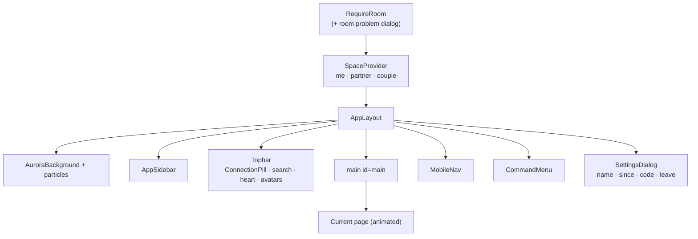
```mermaid
flowchart TD
    RR["RequireRoom<br/>(+ room problem dialog)"] --> SP["SpaceProvider<br/>me · partner · couple"]
    SP --> AL["AppLayout"]
    AL --> AB["AuroraBackground + particles"]
    AL --> AS["AppSidebar"]
    AL --> TB["Topbar<br/>ConnectionPill · search · heart · avatars"]
    AL --> MAIN["main id=main"]
    MAIN --> PAGE["Current page (animated)"]
    AL --> MN["MobileNav"]
    AL --> CM["CommandMenu"]
    AL --> SD["SettingsDialog<br/>name · since · code · leave"]
```

---

## 4.11 Shared data: newest wins

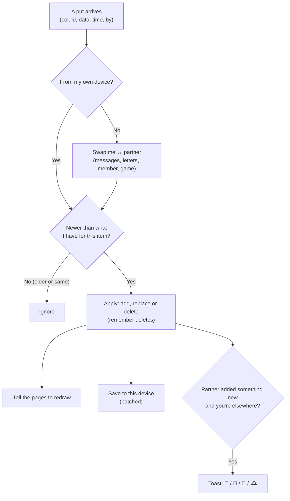
```mermaid
flowchart TD
    P["A put arrives<br/>(col, id, data, time, by)"] --> W{"From my own device?"}
    W -->|"No"| F["Swap me ↔ partner<br/>(messages, letters, member, game)"]
    W -->|"Yes"| N
    F --> N{"Newer than what<br/>I have for this item?"}
    N -->|"No (older or same)"| I["Ignore"]
    N -->|"Yes"| A["Apply: add, replace or delete<br/>(remember deletes)"]
    A --> U["Tell the pages to redraw"]
    A --> S["Save to this device<br/>(batched)"]
    A --> T{"Partner added something new<br/>and you're elsewhere?"}
    T -->|"Yes"| Toast["Toast: 💬 / 💌 / 📅 / 🕰️"]
```

---

## 4.12 Chat: typing, sending and ticks

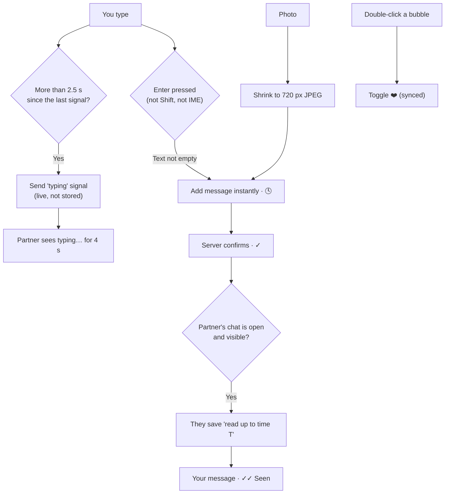
```mermaid
flowchart TD
    A["You type"] --> B{"More than 2.5 s<br/>since the last signal?"}
    B -->|"Yes"| C["Send 'typing' signal<br/>(live, not stored)"]
    C --> D["Partner sees typing… for 4 s"]
    A --> E{"Enter pressed<br/>(not Shift, not IME)"}
    E -->|"Text not empty"| F["Add message instantly · 🕓"]
    F --> G["Server confirms · ✓"]
    G --> H{"Partner's chat is open<br/>and visible?"}
    H -->|"Yes"| I["They save 'read up to time T'"]
    I --> J["Your message · ✓✓ Seen"]
    K["Photo"] --> L["Shrink to 720 px JPEG"] --> F
    M["Double-click a bubble"] --> N["Toggle ❤️ (synced)"]
```

---

## 4.13 Hearts, nudges and presence

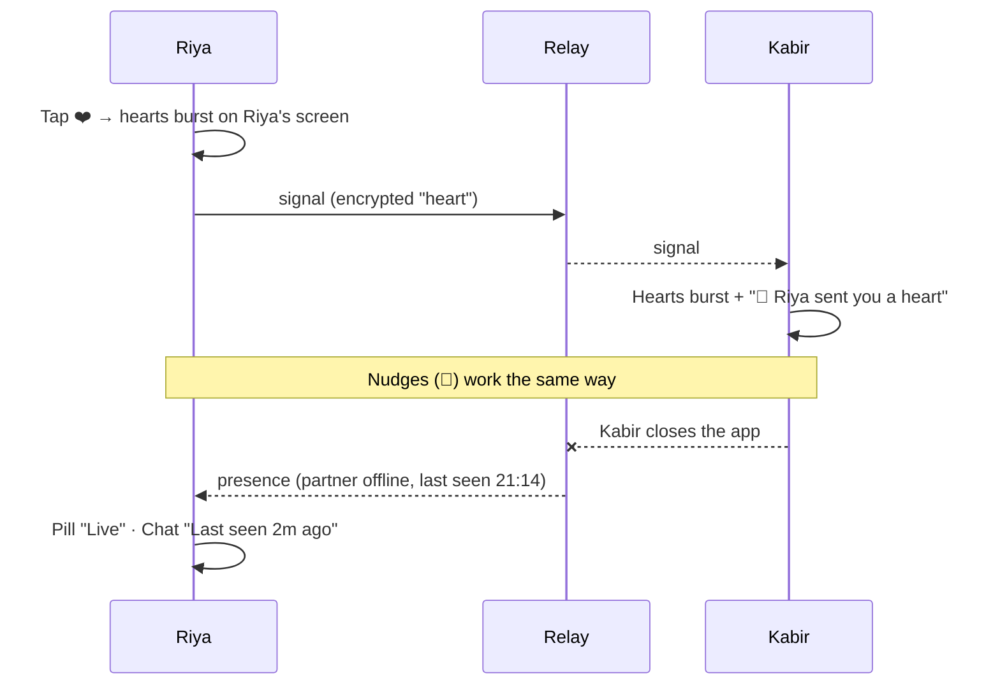
```mermaid
sequenceDiagram
    participant A as Riya
    participant S as Relay
    participant B as Kabir
    A->>A: Tap ❤️ → hearts burst on Riya's screen
    A->>S: signal (encrypted "heart")
    S-->>B: signal
    B->>B: Hearts burst + "💖 Riya sent you a heart"
    Note over A,B: Nudges (💭) work the same way
    B--xS: Kabir closes the app
    S-->>A: presence (partner offline, last seen 21:14)
    A->>A: Pill "Live" · Chat "Last seen 2m ago"
```

---

## 4.14 Two-player tic-tac-toe

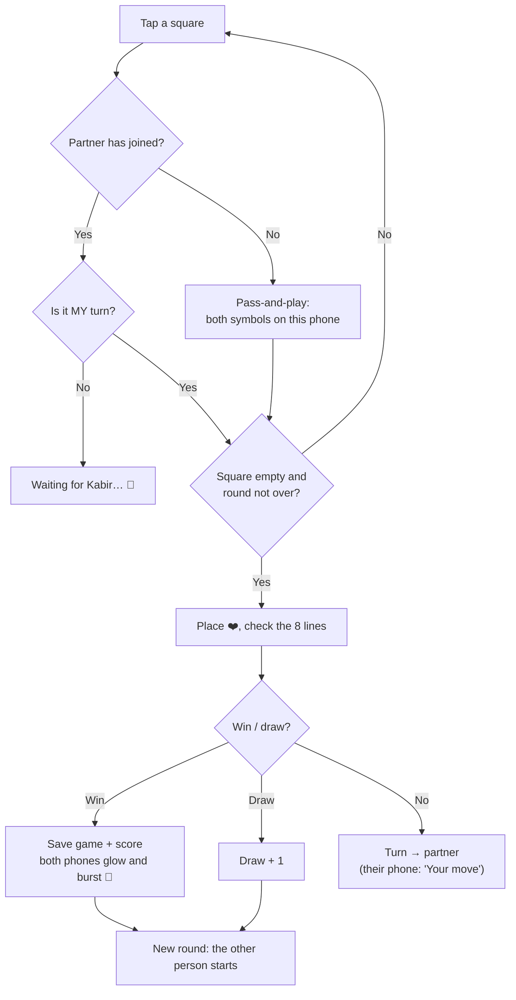
```mermaid
flowchart TD
    A["Tap a square"] --> B{"Partner has joined?"}
    B -->|"No"| C["Pass-and-play:<br/>both symbols on this phone"]
    B -->|"Yes"| D{"Is it MY turn?"}
    D -->|"No"| W["Waiting for Kabir… 💜"]
    D -->|"Yes"| E{"Square empty and<br/>round not over?"}
    C --> E
    E -->|"No"| A
    E -->|"Yes"| F["Place ❤️, check the 8 lines"]
    F --> G{"Win / draw?"}
    G -->|"Win"| H["Save game + score<br/>both phones glow and burst 🎉"]
    G -->|"Draw"| I["Draw + 1"]
    G -->|"No"| J["Turn → partner<br/>(their phone: 'Your move')"]
    H & I --> K["New round: the other person starts"]
```

---

## 4.15 Memory Match, Truth or Dare, Would You Rather

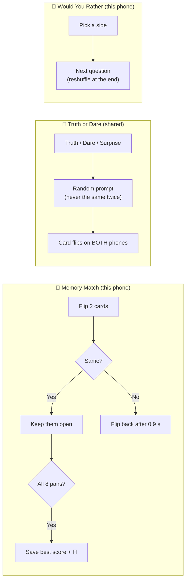
```mermaid
flowchart LR
    subgraph Memory["🧠 Memory Match (this phone)"]
      M1["Flip 2 cards"] --> M2{"Same?"}
      M2 -->|"Yes"| M3["Keep them open"]
      M2 -->|"No"| M4["Flip back after 0.9 s"]
      M3 --> M5{"All 8 pairs?"}
      M5 -->|"Yes"| M6["Save best score + 🎉"]
    end
    subgraph TOD["🎲 Truth or Dare (shared)"]
      T1["Truth / Dare / Surprise"] --> T2["Random prompt<br/>(never the same twice)"] --> T3["Card flips on BOTH phones"]
    end
    subgraph WYR["🤔 Would You Rather (this phone)"]
      W1["Pick a side"] --> W2["Next question<br/>(reshuffle at the end)"]
    end
```

---

## 4.16 Planner

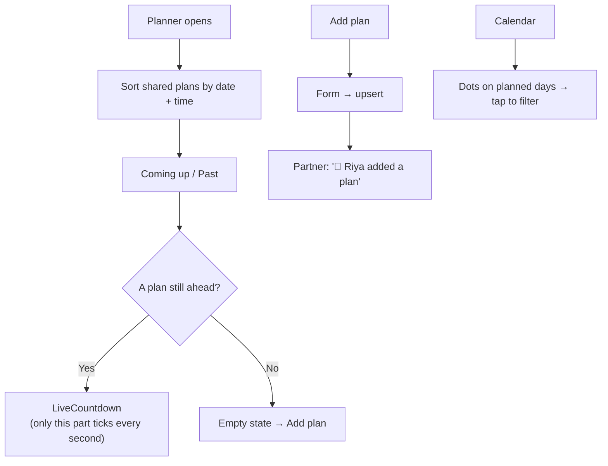
```mermaid
flowchart TD
    A["Planner opens"] --> B["Sort shared plans by date + time"]
    B --> C["Coming up / Past"]
    C --> D{"A plan still ahead?"}
    D -->|"Yes"| E["LiveCountdown<br/>(only this part ticks every second)"]
    D -->|"No"| F["Empty state → Add plan"]
    G["Add plan"] --> H["Form → upsert"] --> I["Partner: '📅 Riya added a plan'"]
    J["Calendar"] --> K["Dots on planned days → tap to filter"]
```

---

## 4.17 Shared music timeline

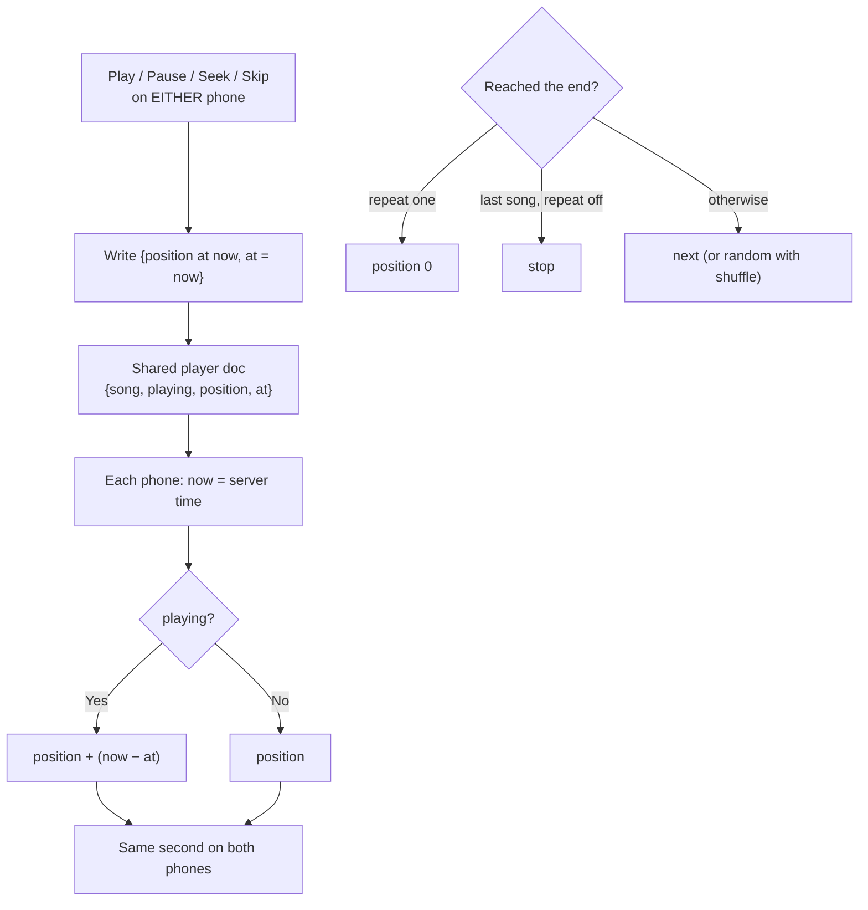
```mermaid
flowchart TD
    D["Shared player doc<br/>{song, playing, position, at}"] --> N["Each phone: now = server time"]
    N --> P{"playing?"}
    P -->|"Yes"| Q["position + (now − at)"]
    P -->|"No"| R["position"]
    Q & R --> UI["Same second on both phones"]
    A["Play / Pause / Seek / Skip<br/>on EITHER phone"] --> S["Write {position at now, at = now}"]
    S --> D
    E{"Reached the end?"} -->|"repeat one"| S1["position 0"]
    E -->|"last song, repeat off"| S2["stop"]
    E -->|"otherwise"| S3["next (or random with shuffle)"]
```

---

## 4.18 Love letters

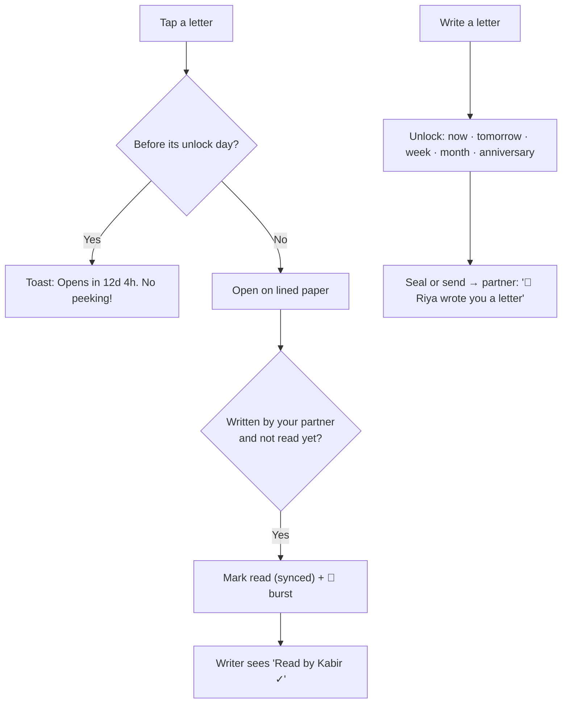
```mermaid
flowchart TD
    A["Tap a letter"] --> B{"Before its unlock day?"}
    B -->|"Yes"| C["Toast: Opens in 12d 4h. No peeking!"]
    B -->|"No"| D["Open on lined paper"]
    D --> E{"Written by your partner<br/>and not read yet?"}
    E -->|"Yes"| F["Mark read (synced) + 💌 burst"]
    F --> G["Writer sees 'Read by Kabir ✓'"]
    H["Write a letter"] --> I["Unlock: now · tomorrow · week · month · anniversary"]
    I --> J["Seal or send → partner: '💌 Riya wrote you a letter'"]
```

---

## 4.19 Timeline

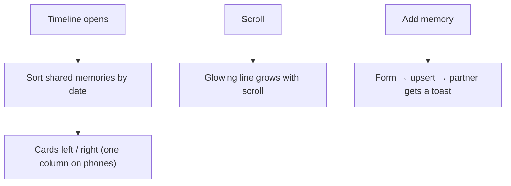
```mermaid
flowchart TD
    A["Timeline opens"] --> B["Sort shared memories by date"]
    B --> C["Cards left / right (one column on phones)"]
    D["Scroll"] --> E["Glowing line grows with scroll"]
    F["Add memory"] --> G["Form → upsert → partner gets a toast"]
```

---

## 4.20 Quick search (Ctrl + K)

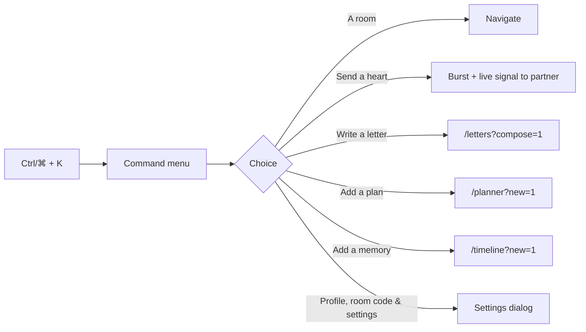
```mermaid
flowchart LR
    A["Ctrl/⌘ + K"] --> B["Command menu"]
    B --> C{"Choice"}
    C -->|"A room"| D["Navigate"]
    C -->|"Send a heart"| E["Burst + live signal to partner"]
    C -->|"Write a letter"| F["/letters?compose=1"]
    C -->|"Add a plan"| G["/planner?new=1"]
    C -->|"Add a memory"| H["/timeline?new=1"]
    C -->|"Profile, room code & settings"| I["Settings dialog"]
```

---

## 4.21 Delete with Undo

```mermaid
flowchart LR
    A["🗑️ on a plan, song,<br/>letter or memory"] --> B["Delete (synced to both)"]
    B --> C["Toast: Removed … [Undo]"]
    C -->|"Undo"| D["Put it back (newer than the delete)"]
    C -->|"Ignore"| E["Stays deleted on both phones"]
```

---

## 4.22 Leave the room

```mermaid
flowchart TD
    A["Settings → Leave this room on this device"] --> B{"Confirm"}
    B -->|"Stay"| Z["Nothing changes"]
    B -->|"Leave"| C["Tell the server: leave"]
    C --> D["Server frees this seat<br/>(partner sees 'Waiting for partner')"]
    C --> E["Delete this room's local copy + session"]
    E --> F["Back to the landing page"]
    D --> G["You can join again later with the code"]
```

---

## 4.23 Phone navigation

```mermaid
flowchart LR
    A["Bottom dock"] --> H["Home"]
    A --> C["Chat"]
    A --> G["Games"]
    A --> P["Planner"]
    A --> M["More"]
    M --> S["Slide-in menu with every room"]
```

---

## 4.24 Running it for real (deployment)

```mermaid
flowchart LR
    Dev["npm run dev<br/>(site + relay on :8080)"] --> Build["npm run build → dist/"]
    Build --> Start["npm start<br/>server/index.mjs"]
    Start --> Serve["Serves dist/ with security headers + gzip"]
    Start --> WS["Relay on /ws<br/>rooms saved in USSPACE_DATA_DIR"]
    Docker["Dockerfile"] --> Start
    Serve & WS --> HTTPS["Put it behind HTTPS<br/>(Render, Railway, Fly.io, a VPS…)"]
    HTTPS --> Phones["📱 📱 Both phones open the same address"]
```

**Back:** [← 3 · Design](03-design.md) · **Next:** [5 · Directory Map →](05-directory-map.md)
